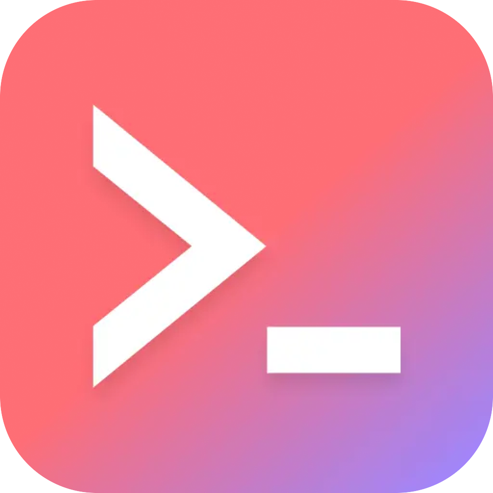
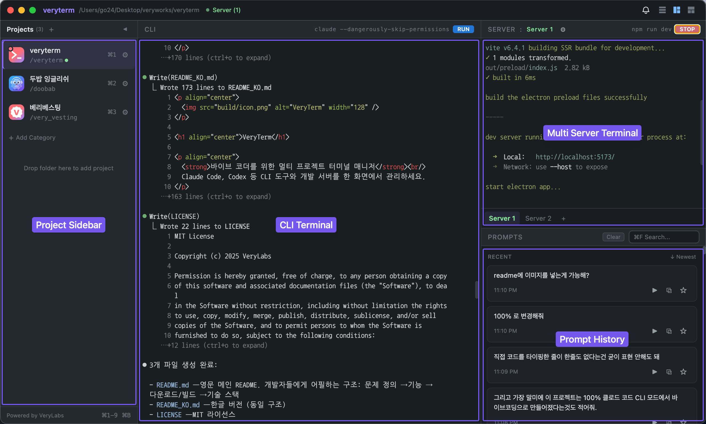
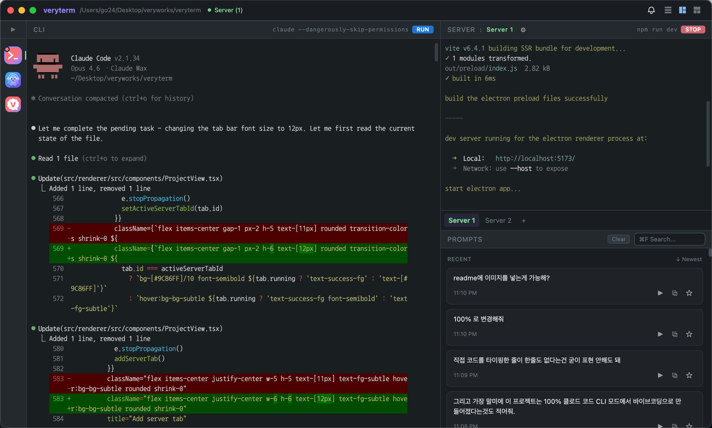

<p align="center">
  
</p>

<h1 align="center">VeryTerm</h1>

<p align="center">
  <strong>Multi-project terminal manager for vibe coders</strong><br/>
  Built for developers who vibe code across multiple projects on a laptop.<br/>
  Manage Claude Code, Codex, and dev servers — all in one window.
</p>

<p align="center">
  <a href="#download">Download</a> &middot;
  <a href="#features">Features</a> &middot;
  <a href="#build-from-source">Build from Source</a> &middot;
  <a href="README_KO.md">한국어</a>
</p>

---

## The Problem

If you vibe code with CLI tools like **Claude Code** or **Codex**, you know the pain:

- Terminal windows piling up everywhere as you juggle multiple projects
- Dev servers scattered across windows — which one is running?
- That perfect prompt you wrote last week? Gone forever
- Context switching between projects kills your flow

**VeryTerm puts everything in one place.**

## Features

### Multi-Project Workspace

Switch between projects instantly with `Cmd+1-9`. Each project gets its own isolated terminal sessions — no cross-contamination, no confusion.

### Dual Terminal Per Project

Every project comes with two terminals:

- **CLI Terminal** — for Claude Code, Codex, or any CLI tool. Auto-starts on project open.
- **Server Terminal** — run `npm run dev`, `cargo watch`, or whatever your stack needs. Supports **multiple server tabs** per project.

### Prompt History

Every prompt you type into the CLI terminal is **automatically captured and saved** per project. Search, pin, and reuse your best prompts. Never lose a good prompt again.

### Server Process Detection

Real-time server status tracking via process detection (not guesswork). See at a glance which projects have running servers — green indicators in the sidebar tell you everything.

### Keyboard-First Design

| Shortcut | Action |
|----------|--------|
| `Cmd+1-9` | Switch projects |
| `Cmd+B` | Toggle sidebar |
| `Tab` | Switch focus between CLI and Server |
| `Cmd+N` | Add project |
| `Cmd+K` | Search prompts |

### More

- **Dark mode only** — no light mode, no compromises
- **Drag & drop** folders from Finder to add projects
- **Category groups** — organize projects with collapsible categories
- **Resizable panels** — drag to resize CLI, server, and prompt panels
- **3 layout modes** — rows, columns, or right-split
- **macOS native notifications** — get notified when CLI tasks finish
- **Auto-update** — stay on the latest version automatically
- **Code signed & notarized** — no Gatekeeper warnings on macOS

## Screenshots

**Sidebar expanded** — Project Sidebar, CLI Terminal, Multi Server Terminal, Prompt History



**Sidebar collapsed** — more room for terminals



## Download

Download the latest `.dmg` from the [Releases](https://github.com/verylabs/veryterm/releases) page.

> macOS only (Apple Silicon). Windows/Linux support is not planned yet but contributions are welcome.

## Build from Source

### Prerequisites

- Node.js 18+
- Python 3.12+ with setuptools (`brew install python-setuptools`)
  - Required for building `node-pty` native module

### Setup

```bash
git clone https://github.com/verylabs/veryterm.git
cd veryterm
npm install
```

### Development

```bash
npm run dev          # Start in dev mode
npm run build        # Production build
npm run typecheck    # Type check
npm run lint         # ESLint
```

### Build DMG

```bash
npm run build && npx electron-builder --mac dmg
```

## Tech Stack

| Layer | Technology |
|-------|-----------|
| Framework | Electron 34 |
| Frontend | React 19 + TypeScript 5 |
| Terminal | xterm.js + node-pty (real PTY) |
| Styling | Tailwind CSS v4 |
| State | Zustand |
| Build | electron-vite + electron-builder |
| Data | Local JSON files (Electron userData) |

## Architecture

```
src/
├── main/           # Main process: node-pty, IPC handlers, native APIs
├── preload/        # contextBridge: exposes window.api
└── renderer/       # React UI, xterm.js, Zustand stores
    └── src/
        ├── components/   # ProjectView, Sidebar, Titlebar, etc.
        ├── stores/       # projectStore, promptStore, uiStore
        └── types/        # TypeScript interfaces
```

### IPC Channels

- `terminal:create/write/resize/kill` — PTY session management
- `terminal:data/exit/processStatus` — terminal output, exit, process detection
- `dialog:selectFolder` — native folder picker
- `data:load/save` — JSON persistence

## Contributing

VeryTerm is open source. Feel free to fork, modify, and make it your own.

1. Fork the repository
2. Create your feature branch (`git checkout -b feature/awesome`)
3. Commit your changes
4. Push to the branch
5. Open a Pull Request

Please credit the original project when redistributing.

## About

**VeryTerm** is built by **Bryan KO**, CEO of [VeryLabs](https://www.verylabs.io).

Born out of the daily frustration of managing multiple vibe coding projects across scattered terminal windows. If you're managing 5+ projects with Claude Code or Codex, this tool is for you.

## Built with Vibe Coding

This project was built entirely through vibe coding in Claude Code CLI mode.

## License

MIT License - see [LICENSE](LICENSE) for details.
